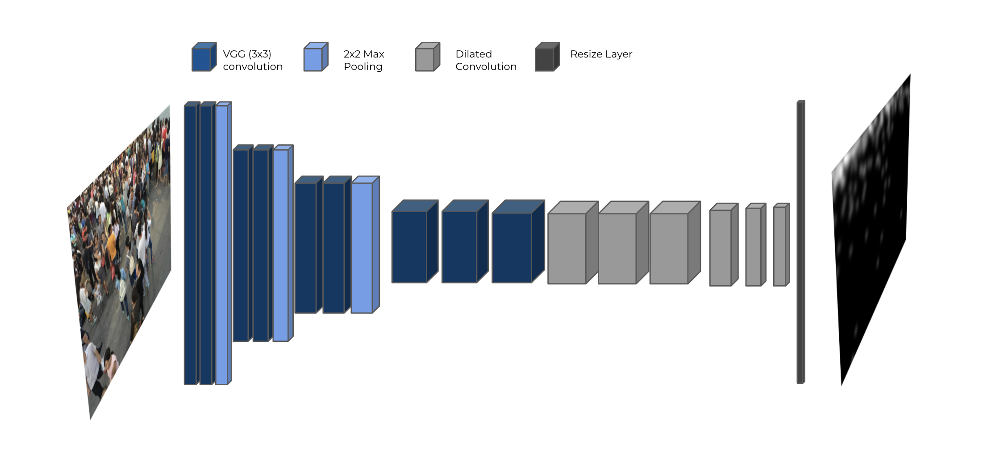
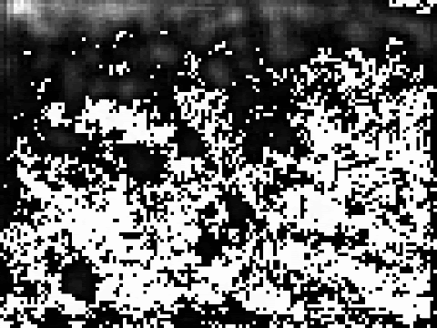
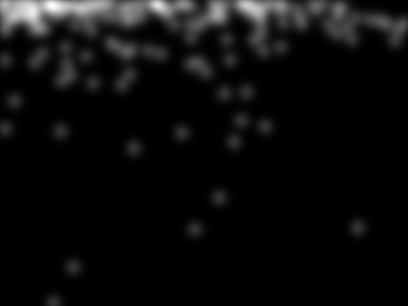
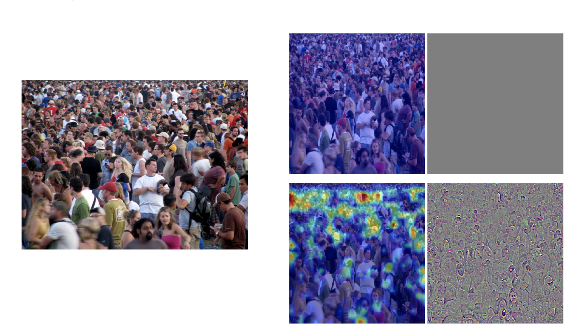
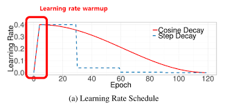
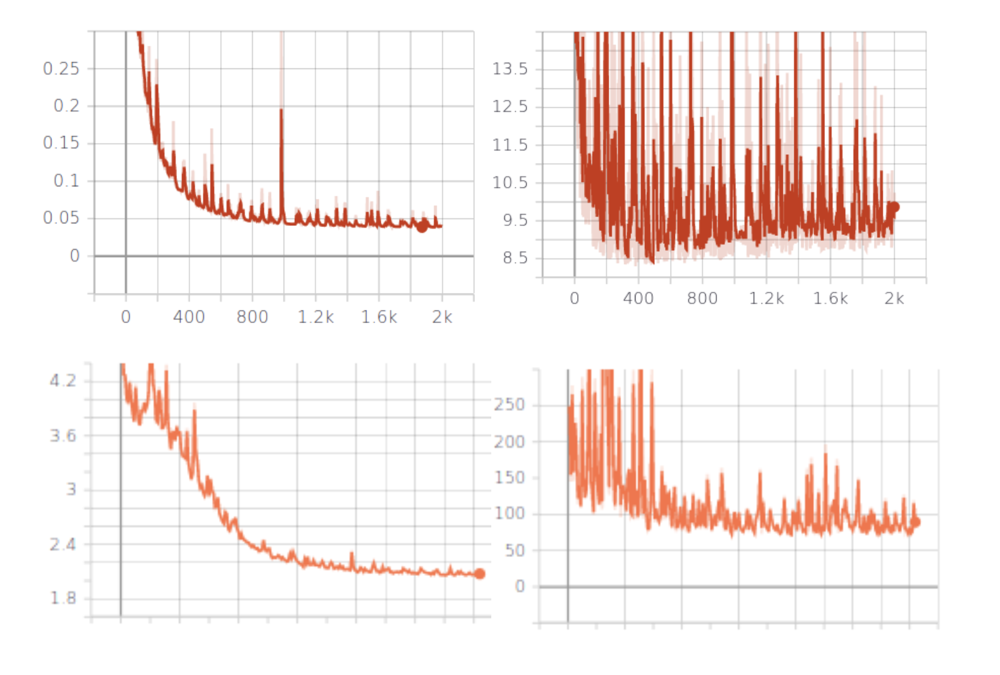
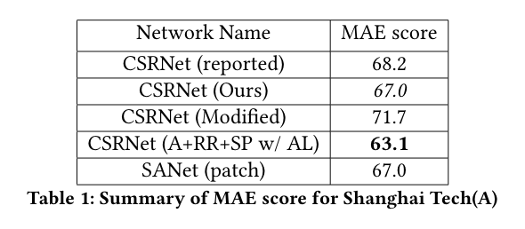
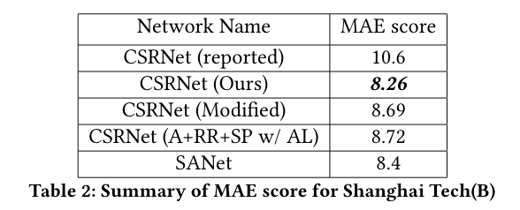
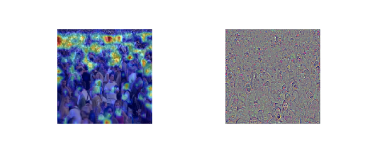

# CSRNet-Simple-Pytorch
This is an simple and clean implemention of CVPR 2018 paper ["CSRNet: Dilated Convolutional Neural Networks for Understanding the Highly Congested Scenes"](https://arxiv.org/abs/1802.10062) for our project for CSCI 4240U Computer Vision. We have added files for several modifications on top of the authors contributions. 

Authors:
Mohammad Mushfequr Rahman and Jessica 

<p align="center">
  
</p>


## Requirement
1. Run `./env.sh` to make sure all of the dependencies are installed (**conda** command can be replaced by **pip**)
2. Clone this repository  
    ```
    git clone https://github.com/Mushfequr-Rahman/Cv_final_project
    ```
3. Do `cd Cv_final_project`, we will call this directory as ROOT

## Data Setup
1. Download ShanghaiTech Dataset from [this link](https://drive.google.com/drive/u/0/folders/1bEKPv2xvYiEISTsktg83_hvt81vgKyu2)
2. Put ShanghaiTech Dataset in `ROOT/data`. 
3. You can find two python scripts in `data_preparation` folder which are used to generate ground truth density-map for ShanghaiTech PartA and PartB respectively. (Mind that you need move the script to corresponding  sub dataset folder e.g. `ROOT/data/part_A_final` and run it)
4. Make sure you have a folder called `ROOT/checkpoints` and place the **weights** under that folder (extension: .pth), the weights can be found [here](https://drive.google.com/drive/u/0/folders/1l_TLNion0JgolwXfOlqcsNzI3iXLsVac)

## Train
1. Modify the dataset root in `config.py`   
2. Run `python train.py`
3. Open the command line and type in `tensorboard --logdir=ROOT/runs`, then browse `localhost:6006` to see the visual result 

<table align="center">
    <tr>
        <td></td>
        <td></td>
    </tr>
</table>

## Testing
1. Run `test.py` to calculate MAE of test images or just show an estimated density-map

## Gradcam
Based on the following paper [Grad-CAM: Visual Explanations from Deep Networks via Gradient-based Localization](https://arxiv.org/pdf/1610.02391.pdf)

Functions implemented is under `gradcam.py` and the demo to attain following result can be found also under `gradcam_demo.ipynb`

<p align="center">
    
</p>

## CIFAR
Dataset that is used for human classification, to train the data set run `python train_people.py` or open `Train_people.ipynb`

<p align="center">
    
</p>

## Our Modification
<p align="center">
    
</p>

## Learning Rate Warm up and Cosine Decay Results
<p align="center">
    
</p>

## Result
<table align="center">
    <tr>
        <td></td>
        <td></td>
    </tr>
</table>

<p align="center">
    
</p>

## Acknowlegedments
1. [CSRnet-pytorch base implementation](https://github.com/CommissarMa/CSRNet-pytorch.git)
2. [GradCam-pytorch base implementation](https://github.com/jacobgil/pytorch-grad-cam)
3. [CIFAR Dataset](https://github.com/pytorch/vision/blob/master/torchvision/datasets/cifar.py)
4. [Pytorch Learning Rate Warmup library](https://github.com/ildoonet/pytorch-gradual-warmup-lr)